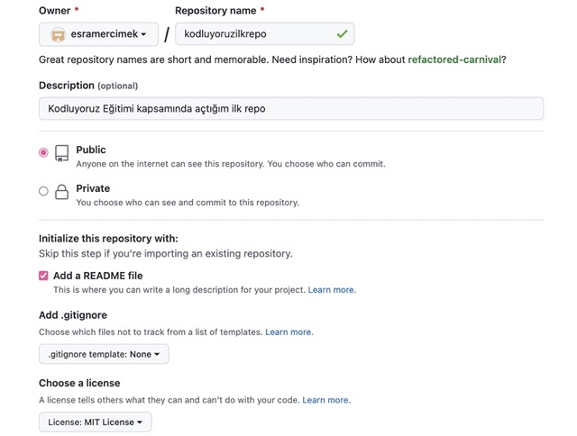

## **Kodluyoruz Ilk Repo**

Bu repo [Kodluyoruz] (https://kodluyoruz.org/tr/kodluyoruz/) Eğitimi kapsamında açtığım ilk repo. İçerisinde bir adet README file, bir adet de index.html barındırıyor.



## **Installation**

Öncelikle projeyi clonelayın. 

```bash
git clone https://github.com/esramercimek/kodluyoruzilkrepo.git
```

## **Usage**

Projeyi clonedeladıktan sonra Visual Studio Code'u açınız.

Linux için:
```linux
cdkodluyoruzilkrepo
code .
```

## **Contrubuting**

Pull requestler kabul edilir. Büyük değişiklikler için, lütfen önce neyi değiştirmek istediğinizi tartışmak için bir konu açınız.


## **License**
[MIT](https://choosealicense.com/licenses/mit/)
